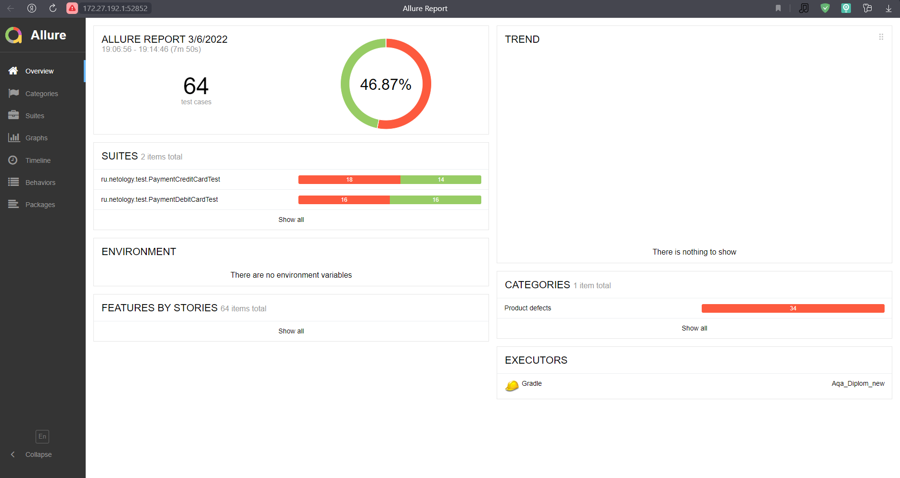

# _Отчет о тестировании_

## _Краткое описание:_
- *Была выполнена автоматизация функционального ручного тестирования покупки тура в Марракеш.*
- *Проверена поддержка двух заявленных СУБД: `MySQL` и `PostgreSQL`. Приложение успешно функционирует с каждой из заявленных СУБД.* 
___
## _Количество тест-кейсов_
***Было автоматизировано 84 тест-кейса:***

- *41 тест-кейс для оплаты тура по дебетовой карте;*
- *43 тест-кейса для покупки тура в кредит;*

***Тест-кейсы содержат UI тесты и запросы, проверяющие информацию в БД.***
___
## _% успешных/не успешных_
- ***Кол-во успешных тест-кейсов:*** *33 тест-кейса (39,28%)*;
- ***Кол-во не успешных тест-кейсов:*** *51 тест-кейс (60,71%)*;

***Скриншот:***

___
## _Общие рекомендации_
***Текущая версия тестируемого приложения не рекомендуется к релизу по ряду следующих выявленных [багов](https://github.com/Valeriya908/Aqa_Diplom/issues):***

:exclamation: ***Рекомендации, носящие обязательный характер:***

1. *Устранить неверное информационное сообщение при попытке совершить оплату по карте со статусом "DECLINED";*

2. *Доработать встроенную валидацию полей, а именно:*
   
   - *Устранить возможность отправки формы при вводе нулевых значений в поля "Номер карты", "Месяц", "CVC/CVV";*
   - *Установить минимальную и максимальную длину текстовых данных для поля "Владелец";*
   - *Установить определение типа данных на которые рассчитано поле "Владелец".*
3. *Привести в соответствие системное сообщение, появляющееся при попытке отправить форму с незаполненным полем "Номер карты", "Месяц", "Год", "CVC/CVV";*
4. *Увеличить допустимый вводимый срок действия карты, по которой производится оплата;*
5. *Устранить ошибочное увдомление об успешной транзакции под всплывающим уведомлением об отказе банка в проведении операции;*
6. *Устранить ошибочное уведомление под заполненным полем "Владелец" о необходимости заполнения поля при попытке отправить форму с пустым полем "CVC/CVV";*
7. *Устранить ошибку при записи информации в СУБД при совершении покупки в кредит;*
8. *Привести в соответствие с содержимым заголовок веб-страницы;*
9. *Исправить орфографическую ошибку в написании города на рекламном изображении;*

:exclamation: ***Рекомендовано добавить уникальные css-селекторы путем добавления уникальных "data-test-id" для упрощения и ускорения процесса автоматизации.***
